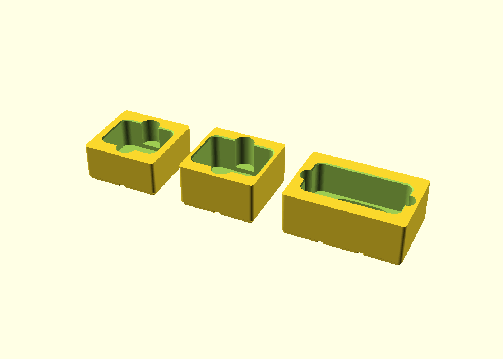

# Contenitori Gridfinity per le camere Insta360

Tre bin Gridfinity su misura per riporre le camere nella valigetta Gridfinity
stampata. Ogni camera resta **completamente sotto il bordo del bin**, quindi il
coperchio della valigetta si chiude senza toccarla.

| Camera | Come si ripone | Bin (celle) | Altezza | File STL |
|---|---|---|---|---|
| **Insta360 GO 3S** (nell'Action Pod chiuso, 63,5 × 47,6 × 29,5 mm) | Pod sdraiato, lente in su | 2 × 2 | 6 unità = **42 mm** | `stl/insta360_go3s_2x2_6u.stl` |
| **Insta360 Ace Pro 2** (schermo chiuso, 71,9 × 52,15 × 38,0 mm) | Sdraiata, lente in su | 2 × 2 | 7 unità = **49 mm** | `stl/insta360_ace_pro_2_2x2_7u.stl` |
| **Insta360 X6** (corpo 100,0 × 50,0 × 26,4 mm, ~40,6 mm con le lenti) | Sdraiata, in qualsiasi verso | 3 × 2 | 7 unità = **49 mm** | `stl/insta360_x6_3x2_7u.stl` |

I tre bin insieme occupano 16 celle Gridfinity (4 + 4 + 8).



## Prima di stampare: controlla l'altezza della valigetta

I bin di Ace Pro 2 e X6 sono alti **49 mm** (7 unità): la valigetta deve
chiudersi sopra bin da 7 unità. Misura lo spazio interno della tua valigetta
(dalla baseplate al coperchio chiuso): serve **almeno 50 mm**.

- Se la valigetta accetta solo bin da 6 unità (42 mm), il bin del GO 3S va bene
  così com'è, ma Ace Pro 2 e X6 sono troppo spesse per stare *dentro* un bin
  da 42 mm: non è un limite del disegno, è proprio la misura delle camere
  (38 mm la Ace, ~40,6 mm la X6 con le lenti, più il fondo del bin).
- Il bin del GO 3S può anche essere alzato a 7 unità (parametro `go3s_unita = 7`
  nel file `.scad`) se preferisci i tre bin tutti alla stessa altezza.

## Come sono fatti

- **Piede Gridfinity standard**: si agganciano a qualsiasi baseplate.
- **Bordo piatto, senza labbro di impilamento**: l'altezza è esattamente
  unità × 7 mm e niente sporge oltre il bordo.
- **Tasca su misura** con 1,5 mm di gioco totale: la camera entra ed esce senza
  forzare ma non balla.
- **Prese per le dita** su due lati per estrarre la camera facilmente.
- **Smusso d'invito** sul bordo della tasca.
- **X6 – vasca salva-lenti**: nel fondo c'è una vasca ribassata; la camera
  appoggia sul corpo (sui bordi della vasca) e la lente rivolta in giù resta
  sospesa nel vuoto, senza mai toccare la plastica. Funziona con la camera
  inserita in entrambi i versi. Anche la lente rivolta in su resta oltre 1 mm
  sotto il bordo del bin.
- **Fori per magneti 6 × 2 mm** nel fondo (standard Gridfinity, 4 per cella):
  utili in una valigetta da trasporto; se non metti i magneti i fori non
  danno alcun fastidio. Si tolgono con `fori_magneti = false`.
- **Nome inciso** sul fondo di ogni tasca (GO 3S / ACE PRO 2 / X6).

## Consigli di stampa

- PLA o PETG, ugello 0,4 mm, layer 0,2 mm.
- 2–3 perimetri, riempimento 10–15 %, **niente supporti** (non servono).
- Stampali così come sono orientati (piedini sul piatto).
- Se vuoi proteggere gli schermi, un dischetto di feltro adesivo sul fondo
  della tasca è un'ottima aggiunta.

## Personalizzare

Apri `insta360_gridfinity.scad` in OpenSCAD: tutti i parametri sono in cima al
file con il Customizer (misure delle camere, gioco della tasca, altezze in
unità, magneti sì/no, incisioni). Per rigenerare gli STL da terminale:

```sh
openscad -o stl/insta360_go3s_2x2_6u.stl      -D 'modello="go3s"'    insta360_gridfinity.scad
openscad -o stl/insta360_ace_pro_2_2x2_7u.stl -D 'modello="acepro2"' insta360_gridfinity.scad
openscad -o stl/insta360_x6_3x2_7u.stl        -D 'modello="x6"'      insta360_gridfinity.scad
```

## Misure usate (fonti)

- GO 3S – Action Pod chiuso 63,5 × 47,6 × 29,5 mm:
  [manuale Insta360](https://onlinemanual.insta360.com/go3s/en-us/specs/hardware-specs/hardware)
- Ace Pro 2 – schermo chiuso 71,9 × 52,15 × 38,0 mm:
  [manuale Insta360](https://onlinemanual.insta360.com/acepro2/en-us/specs/hardware/ap2-specs)
- X6 – 50,0 × 100,0 × 26,4 mm, 196 g (corpo), ~40,6 mm con le lenti:
  [manuale Insta360](https://onlinemanual.insta360.com/x6-user-manual/en-us/specs/hardware) e
  [recensioni al lancio](https://ultimatemotorcycling.com/2026/08/14/insta360-x6-first-look/)

Se una misura non ti torna (ad es. con paralenti montati), correggila nel
`.scad` e rigenera: le tasche si adattano da sole.
