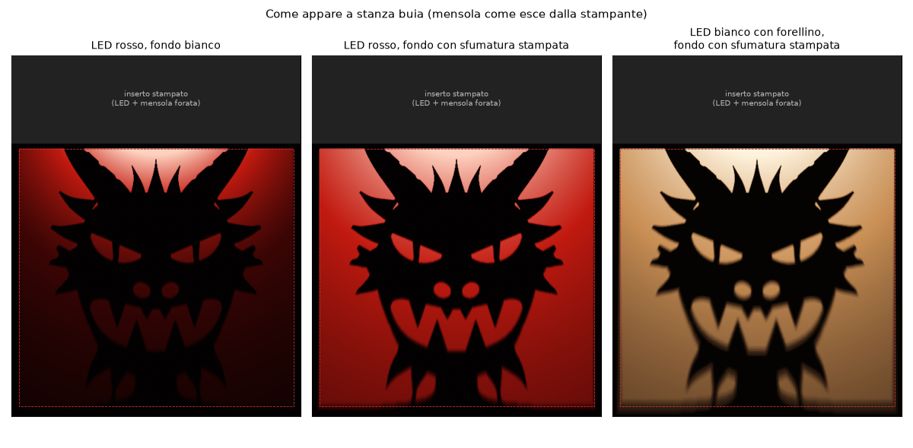
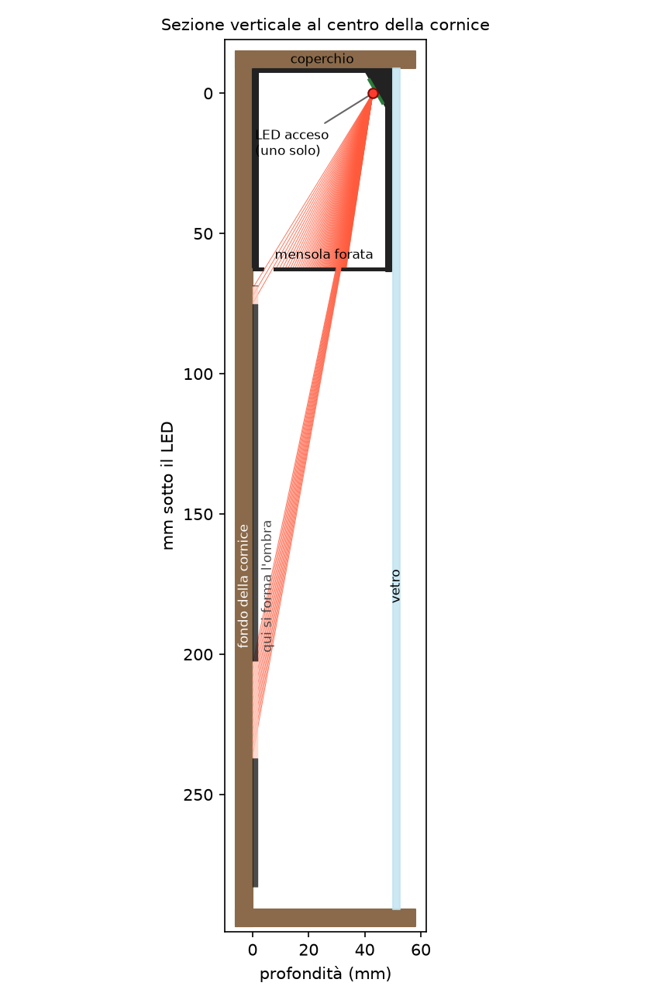
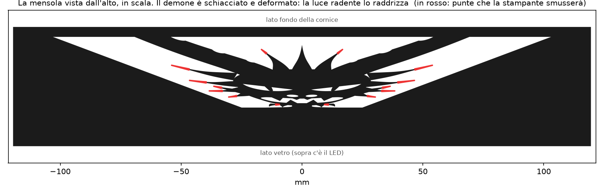
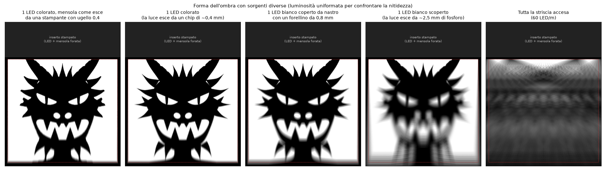
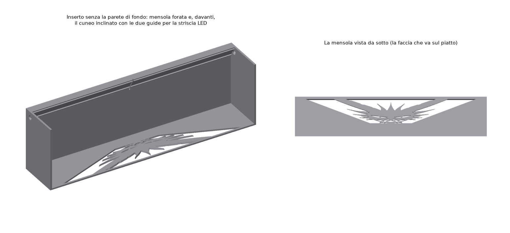
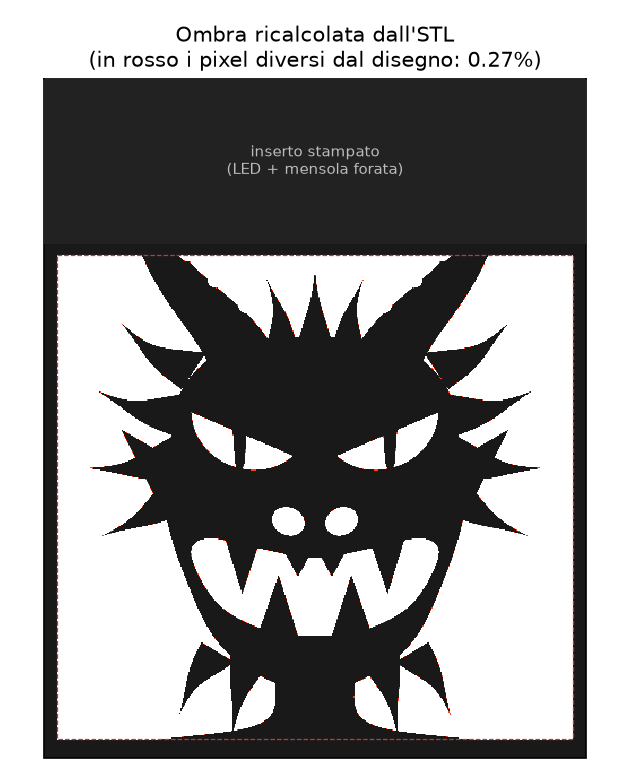

# Lightbox Oni: un'ombra che disegna un demone

Una cornice con la luce solo in alto. Con la stanza accesa si vede un fondo quasi vuoto.
Spegni la luce, accendi il LED in cima, e l'ombra che scende sul fondo disegna un **Oni**:
corna, criniera, occhi da gatto e zanne.



Tutte le immagini qui sono **simulate**: il programma traccia i raggi dal LED attraverso il
pezzo stampato, fino al fondo. Il pezzo non è ancora stato stampato né provato.

---

## Come funziona

In cima alla cornice c'è un inserto stampato in 3D con due parti:

- **un LED**, montato sulla parete davanti, che guarda il fondo, un po' inclinato verso il basso;
- **una mensola orizzontale forata**, 62 mm sotto il LED.

La luce scende radente sul fondo. Arriva solo dove passa dai fori della mensola: il resto è
ombra. La mensola è una diapositiva, ma **deformata apposta**. Con la luce radente, un millimetro
di mensola diventa meno di 2 mm d'ombra in cima al quadro e circa 30 mm in fondo. Per questo, sulla
mensola, il demone è schiacciato e allargato a ventaglio. La luce lo raddrizza.





### È un foro stenopeico al contrario

La geometria è quella della camera stenopeica: ogni raggio passa per un solo punto, il LED.
E vale la stessa regola: **più il punto è piccolo, più l'immagine è nitida**. Per questo:

- **deve essere acceso UN solo LED.** Con tutta la striscia accesa ogni LED proietta il suo
  demone, spostato rispetto agli altri. È una camera multi-foro: le immagini si sovrappongono
  e resta una poltiglia grigia (ultima colonna qui sotto).
- **un LED colorato è molto più nitido di uno bianco.** Nel LED rosso la luce esce dal chip,
  un granello di circa 0,4 mm. Nel bianco esce da tutto il fosforo giallo, circa 2,5 mm.
- **un LED bianco torna nitido se lo copri con nastro nero e fai un forellino da 0,8 mm.**
  È letteralmente uno stenoscopio.



La prima colonna è la più realistica: simula anche la stampante. Toglie fessure e punte più
sottili di un ugello da 0,4 mm.

### Perché una mensola forata e non dei rilievi sul fondo

Un rilievo attaccato al fondo fa un'ombra che parte dal rilievo e scende in una sola striscia.
Con rilievi solo in cima si ottengono solo "stalattiti", non un disegno con occhi e bocca. La
mensola forata invece controlla ogni punto del quadro: ogni punto del fondo riceve luce da un
solo punto della mensola.

---

## Cosa serve

| | |
|---|---|
| Cornice | **a cassetta 24×30 cm**, misure interne 240 × 300 mm, **profonda 50 mm** dal fondo al vetro. **Vetro trasparente**, non satinato. Con misure diverse si rigenera tutto (vedi sotto). |
| Filamento | **nero e opaco** (PLA o PETG). Un filamento bianco o chiaro lascia passare luce attraverso la mensola e rovina le ombre. |
| LED | vedi sotto |
| Fondo | cartoncino **bianco opaco** 240×300, oppure lo sfondo sfumato stampato (vedi più avanti) |
| Varie | nastro isolante nero, biadesivo, calibro |

### Quale LED

L'inserto ha una sede per una striscia larga 10 mm, per tutta la larghezza. Qualsiasi striscia
va bene, purché **ne resti acceso un solo LED, quello al centro**.

1. **Il più semplice: striscia rossa a 5 V con presa USB** (LED 2835, larga 10 mm). Si incolla
   tutta e si coprono con nastro isolante nero tutti i LED tranne quello centrale. Rosso
   monocolore vuol dire chip piccolo, quindi ombra nitida. Ed è la luce giusta per un demone.
2. **Il più flessibile: striscia WS2812B** con un ESP32 e il firmware WLED, che si installa dal
   browser. Accendi solo il LED centrale e **un solo colore puro** (solo rosso, solo verde o solo
   blu: ognuno è un chip). Due colori insieme sono due chip distanti 1 mm, quindi due ombre
   sfalsate. Bonus: con tutti i LED accesi il demone si dissolve, con uno solo riappare. È un
   effetto "rivelazione" gratis.
3. **Se vuoi luce bianca calda:** striscia bianca con un pezzetto di nastro isolante nero sul LED
   centrale, forato con uno spillo (circa 0,8 mm). Esce poca luce (circa un decimo), ma resta
   nitida.

Un LED bianco scoperto funziona, ma viene sfocato: guarda la quarta colonna della simulazione.

---

## Stampa

File in `out/`:

- **`inserto.stl`**: 239 × 49,5 × 71 mm, circa 105 cm³. Va stampato così com'è: mensola sul
  piatto e pareti in su. **Non servono supporti**: il cuneo del LED sporge di 30°.
- **`coperchio.stl`**: una lastrina da 1,2 mm con un bordino. Chiude l'inserto in alto.
  Senza coperchio la luce che sale rimbalza sul soffitto della cornice e schiarisce le ombre.

Impostazioni:

- strato 0,2 mm, ugello 0,4, **non scalare il pezzo**;
- attiva la **compensazione del piede d'elefante** (0,1–0,15 mm). Il primo strato è la faccia
  della mensola: se si allarga, chiude le fessure più fini (occhi, bocca);
- "chiusura fessure / slice closing radius" al minimo;
- 239 mm entra nei piatti da 250 e 256 mm (Prusa MK4, Bambu). Su un piatto da 220 mm mettilo
  in diagonale: entra.

Le pareti dei fori non sono verticali: sono inclinate come i raggi di luce. È voluto: così lo
spessore della mensola non mangia luce.



---

## Montaggio

1. **Misura lo spessore della striscia**, dal retro dell'adesivo alla superficie del LED. Il
   progetto usa 1,6 mm. Se è diverso, rigenera con `--spessore-striscia`: è la misura che più
   deforma il fondo dell'immagine (0,5 mm di errore spostano il fondo del disegno di circa 1 cm).
2. Incolla la striscia sul cuneo inclinato, **tra le due guide**, con un LED **esattamente sulla
   tacca centrale**. I fili escono dai fori sui fianchi.
3. Lascia acceso solo quel LED (nastro nero sugli altri, oppure WS2812B).
4. Metti il fondo bianco (o lo sfondo sfumato) nella cornice.
5. Infila l'inserto in alto: la parete posteriore contro il fondo, quella con la striscia verso il
   vetro. Appoggia il coperchio e fissa tutto con un po' di biadesivo sul retro.
6. Stanza buia, LED acceso.

---

## La luce cala verso il basso (e come rimediare)

La luce radente arriva sempre più obliqua e più lontana. **In fondo al quadro arriva circa 25
volte meno luce che in cima**, anche con il LED inclinato di 30°, che già la raddoppia. L'occhio
al buio si adatta, ma il demone "affonda" verso il basso (primo riquadro in cima alla pagina).

Il rimedio facoltativo è **`out/sfondo_sfumato.png`**: un fondo da stampare in scala 1:1
(240×300 mm a 300 dpi, quindi serve un A3 o una copisteria). È grigio scuro in alto e bianco in
basso, calcolato per compensare metà del calo di luce, in scala logaritmica. Il calo scende da
25 volte a meno di 5 (secondo riquadro). Con la stanza accesa si vede una sfumatura, tipo
nebbia; al buio compare il demone.

Per compensare di più o di meno: `--compensazione 0.7` o `--compensazione 0.3`.

---

## Cambiare misure o disegno

Serve Python 3.

```bash
cd lightbox-oni
pip install -r requirements.txt
python3 genera.py                                  # Oni, cornice 24x30x5
python3 genera.py --larghezza 300 --altezza 400 --profondita 60
python3 genera.py --immagine mia_sagoma.png        # PNG: nero = ombra
python3 genera.py --help                           # tutte le opzioni
```

Ogni volta rigenera tutto (STL, simulazioni, sfondo) e scrive i numeri in `out/riepilogo.json`.

Le opzioni che contano:

- `--profondita`: **più la cornice è profonda, meglio è**. La luce è meno radente, quindi più
  nitida e più uniforme.
- `--mensola`: quanto sta sotto il LED la mensola (62 mm). Più in basso vuol dire più nitido, ma
  la fascia nera in alto si allunga.
- `--inclinazione-led`: 30° di default. Con un LED bianco scoperto meglio 0.

### Regole per disegnare una sagoma propria

La sagoma è un PNG in bianco e nero; il nero è l'ombra. La tela intera del PNG finisce nel quadro.

- **Ogni parte nera deve toccare un bordo della tela**, come le corna e le spalle dell'Oni.
  Altrimenti, nella mensola, sarebbe un pezzo staccato e cadrebbe. Il programma avvisa.
- **I dettagli orizzontali (fessure, occhi a mandorla) devono essere alti**: 3–4 mm bastano
  in cima al quadro, a metà ne servono 7, verso il fondo 15–20. La mensola li schiaccia in
  verticale: circa 9 volte a metà quadro, 30 volte in fondo. I dettagli verticali possono
  essere molto più fini, perché in orizzontale lo schiacciamento è poco. Le pupille dell'Oni
  sono verticali proprio per questo.
- Guarda sempre la prima colonna di `simulazione.png`, quella "come esce dalla stampante".

---

## Numeri del progetto attuale

Da `out/riepilogo.json`, per la cornice 24×30×5 con LED rosso:

| | |
|---|---|
| LED | faccia a 42,9 mm dal fondo, 9 mm sotto il bordo alto, inclinato di 30° |
| Fascia nera in alto (inserto) | 72,6 mm |
| Quadro dell'ombra | da 69 a 283 mm sotto il LED, 228 mm di larghezza |
| Bordo sfumato dell'ombra (LED rosso) | circa 1 mm in alto, 3 mm a metà, 7 mm in fondo |
| Bordo sfumato (LED bianco scoperto) | 5 mm in alto, 17 mm a metà, 40 mm in fondo |
| Verifica: ombra ricalcolata dall'STL vs disegno | 0,27% di pixel diversi, tutti sui bordi |



## Cosa non è simulato

- l'emissione reale del LED: la simulazione usa un emettitore lambertiano ideale. Ai bordi i
  LED veri calano di più, e questo cambia un po' la sfumatura in basso;
- i riflessi dentro la cornice. Per questo il consiglio è inserto nero e coperchio;
- le tolleranze di montaggio. Se l'ombra viene un po' allungata o schiacciata in basso, la
  causa quasi sempre è lo spessore della striscia (punto 1 del montaggio).

## File

| | |
|---|---|
| `genera.py` | il programma: proiezione, STL, simulazioni |
| `oni_sagoma.py` | il disegno dell'Oni, fatto di forme geometriche (niente immagini prese da altri) |
| `out/inserto.stl`, `out/coperchio.stl` | da stampare |
| `out/sfondo_sfumato.png` | fondo facoltativo, 1:1 a 300 dpi |
| `out/*.png` | simulazioni e schemi |
